Archives des ateliers DIY Electronique de Rémi Sarrailh au LABSud
-----------------------
Ces archives proviennent de l'ancien discord du LABSUD : https://discord.com/invite/PysSZb8   

# Sommaire
- [Sommaire](#sommaire)
- [1 - (7 Décembre 2018)](#1---7-décembre-2018)
  - [Interrupteur / Passerelle USB pour Ampoule Milight à base d'arduino nano](#interrupteur--passerelle-usb-pour-ampoule-milight-à-base-darduino-nano)
  - [Station Météo (BME280/TSL2561) avec auto-détection I2C des capteurs](#station-météo-bme280tsl2561-avec-auto-détection-i2c-des-capteurs)
- [2 - (11 Janvier 2019)](#2---11-janvier-2019)
  - [SonOff S20 - Prise connecté WiFi avec firmware open source et communication en MQTT (Tasmota)](#sonoff-s20---prise-connecté-wifi-avec-firmware-open-source-et-communication-en-mqtt-tasmota)
  - [RFLink passerelle radio open source à base d'Arduino Mega (ASK 433Mhz / Milight 2.4ghz etc...)](#rflink-passerelle-radio-open-source-à-base-darduino-mega-ask-433mhz--milight-24ghz-etc)
  - [ESP8266 Série vers MQTT](#esp8266-série-vers-mqtt)
  - [Communication de Capteurs ESP32 WiFi/MQTT et MySensors Lora (Mysensors avec le RFM95)](#communication-de-capteurs-esp32-wifimqtt-et-mysensors-lora-mysensors-avec-le-rfm95)
  - [Odroid-Go, la gameboy à base d'ESP32 d'Odroid programmable](#odroid-go-la-gameboy-à-base-desp32-dodroid-programmable)
  - [Flute-Midi,une flute à base d'ESP32 connectable à un ordinateur en bluetooth MIDI.](#flute-midiune-flute-à-base-desp32-connectable-à-un-ordinateur-en-bluetooth-midi)
- [3 - (1 Février 2019)](#3---1-février-2019)
  - [Lancement des tutoriaux sur hackter.io et wikifab](#lancement-des-tutoriaux-sur-hackterio-et-wikifab)
  - [Contrôler des strips de LED neopixels avec un protocole utilisé par les techniciens lumières (DMX over net ArtNet)](#contrôler-des-strips-de-led-neopixels-avec-un-protocole-utilisé-par-les-techniciens-lumières-dmx-over-net-artnet)
  - [Présentations des types de moteurs et de comment les contrôler.](#présentations-des-types-de-moteurs-et-de-comment-les-contrôler)
- [4 - (8 Mars 2019)](#4---8-mars-2019)
  - [Afficheurs OLED](#afficheurs-oled)
  - [Arduino MKR1010](#arduino-mkr1010)
  - [M5Stick](#m5stick)
- [Arduino Days 2019](#arduino-days-2019)
  - [📄 Documents Arduino Days 2019](#-documents-arduino-days-2019)
  - [Projets Rémi](#projets-rémi)
- [5 - (5 Avril 2019)](#5---5-avril-2019)
  - [Microcontrôleurs (domotique)](#microcontrôleurs-domotique)
    - [Pro Mini (modifié)](#pro-mini-modifié)
    - [Lora32u4](#lora32u4)
    - [Lolin32](#lolin32)
  - [Logiciels](#logiciels)
    - [Solution modulaire](#solution-modulaire)
    - [Domotique](#domotique)
- [6 - (3 Mai 2019)](#6---3-mai-2019)
  - [Un synthétiseur/sampleur à base d’esp8266 avec entrée USB (USB Host) (mozzi)](#un-synthétiseursampleur-à-base-desp8266-avec-entrée-usb-usb-host-mozzi)
  - [Une mini matrice de LED connectées (HTTP/MQTT / Chiffrement / Bug overflow)](#une-mini-matrice-de-led-connectées-httpmqtt--chiffrement--bug-overflow)
- [7 - (7 Juin 2019)](#7---7-juin-2019)
  - [Mini matrice de LED contrôlable depuis une interface Web integré ou Node-Red](#mini-matrice-de-led-contrôlable-depuis-une-interface-web-integré-ou-node-red)
- [8 - (5 Juillet 2019)](#8---5-juillet-2019)
  - [Présentation de ma passerelle LoraWan à base d'esp32](#présentation-de-ma-passerelle-lorawan-à-base-desp32)
  - [Capteur BME280 avec un lora32u4](#capteur-bme280-avec-un-lora32u4)
  - [intégration sur une interface Mosquitto/NodeRed/Grafana/InfluxDB sur un serveur privé VPS](#intégration-sur-une-interface-mosquittonoderedgrafanainfluxdb-sur-un-serveur-privé-vps)
  - [Présentation de Julien Doutre sur le projet Ro-boat](#présentation-de-julien-doutre-sur-le-projet-ro-boat)
  - [Présentation de Patrick du capteur EMG](#présentation-de-patrick-du-capteur-emg)
  - [Croquis / Bibliothèque de la passerelle ESP32 LoRa](#croquis--bibliothèque-de-la-passerelle-esp32-lora)
- [9 - (6 Septembre 2019)](#9---6-septembre-2019)
  - [Recyclage Netbook en bartop](#recyclage-netbook-en-bartop)
  - [Présentation des M5Stick-C](#présentation-des-m5stick-c)
    - [Programation](#programation)
    - [Led Infrarouge](#led-infrarouge)
    - [Communication MQTT](#communication-mqtt)
    - [Mode Veille / Capteur PIR](#mode-veille--capteur-pir)
    - [Strip Neopixels](#strip-neopixels)
- [10 - (4 Octobre 2019)](#10---4-octobre-2019)
  - [Portes ouvertes](#portes-ouvertes)
    - [Console ESP32 -](#console-esp32--)
    - [Adafruit Trellis m4 -](#adafruit-trellis-m4--)
    - [Synthé midi à base de keypad](#synthé-midi-à-base-de-keypad)
    - [Capteur météo LoRaWan: #8ème-atelier](#capteur-météo-lorawan-8ème-atelier)
    - [Afficheur epaper météo sur batterie](#afficheur-epaper-météo-sur-batterie)
    - [Clavier Twitter](#clavier-twitter)
    - [Capteur PIR MQTT](#capteur-pir-mqtt)
    - [Station météo Yun : https://m5stack.com/collections/m5-unit/products/m5stickc-yun-hatsh20-bmp280-sk6812](#station-météo-yun--httpsm5stackcomcollectionsm5-unitproductsm5stickc-yun-hatsh20-bmp280-sk6812)
    - [M5Stick-C Neoflash :  https://docs.m5stack.com/#/en/hat/hat-neoflash](#m5stick-c-neoflash---httpsdocsm5stackcomenhathat-neoflash)
    - [Lightbar](#lightbar)
    - [ESPMessenger](#espmessenger)
    - [minimatrix-leds](#minimatrix-leds)
- [11 - (Novembre 2019)](#11---novembre-2019)
  - [LoraCube](#loracube)
  - [Minimatrix-leds](#minimatrix-leds-1)
  - [Lightbar](#lightbar-1)
  - [Pwnagotchi](#pwnagotchi)
  - [Youtubers / Tutos ESP32](#youtubers--tutos-esp32)
- [12 - (Décembre 2019)](#12---décembre-2019)
- [13 - (Janvier 2020)](#13---janvier-2020)
  - [Projets Musicals et LoraWan (pdf)](#projets-musicals-et-lorawan-pdf)
- [14 - (Février 2020)](#14---février-2020)
  - [Lum0s : Un strip de LED RGBW WiFi alimenté par un Powerbank](#lum0s--un-strip-de-led-rgbw-wifi-alimenté-par-un-powerbank)
    - [s1nT : Un synthé à base d'Arduino Nano :](#s1nt--un-synthé-à-base-darduino-nano-)
    - [espMessenger : Une matrice de LED WiFi pour afficher des messages](#espmessenger--une-matrice-de-led-wifi-pour-afficher-des-messages)
  - [MakerDiary NRF52840 USB Dongle](#makerdiary-nrf52840-usb-dongle)
  - [M5Stack Atom Matrix](#m5stack-atom-matrix)
    - [Mur de leds (WS2811) avec caméra ESP32](#mur-de-leds-ws2811-avec-caméra-esp32)
- [15 - (5 Mars 2020)](#15---5-mars-2020)
  - [Conception PCB](#conception-pcb)
  - [Musique (AY-3-8910)](#musique-ay-3-8910)
# 1 - (7 Décembre 2018)

## Interrupteur / Passerelle USB pour Ampoule Milight à base d'arduino nano
https://github.com/pigetArduino/milightONOFF

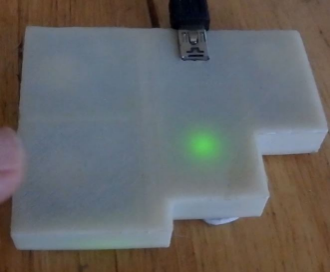

## Station Météo (BME280/TSL2561) avec auto-détection I2C des capteurs
https://github.com/usini/epimetheus

[↩ Sommaire](#sommaire)

# 2 - (11 Janvier 2019)

## SonOff S20 - Prise connecté WiFi avec firmware open source et communication en MQTT (Tasmota)   
https://tasmota.github.io/docs/devices/Sonoff-S20/   
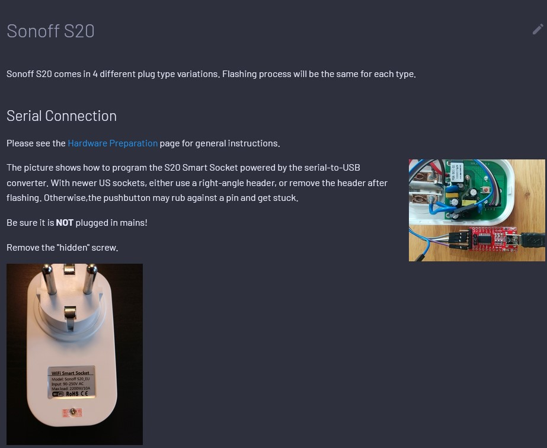

## RFLink passerelle radio open source à base d'Arduino Mega (ASK 433Mhz / Milight 2.4ghz etc...)
https://easydomoticz.com/rflink-un-module-433mhz-arduino-mega-partie-1-le-materiel/

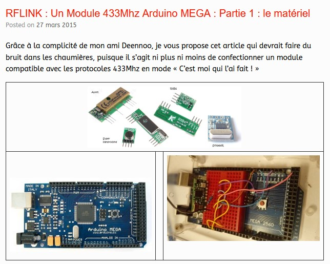

## ESP8266 Série vers MQTT
📄 [Introduction à MQTT.pdf](documents/Introduction_a_MQTT.pdf)   
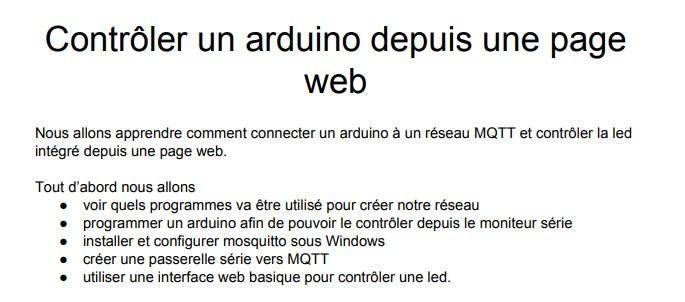

## Communication de Capteurs ESP32 WiFi/MQTT et MySensors Lora (Mysensors avec le RFM95)

## Odroid-Go, la gameboy à base d'ESP32 d'Odroid programmable
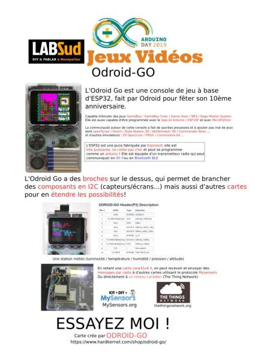

## Flute-Midi,une flute à base d'ESP32 connectable à un ordinateur en bluetooth MIDI.

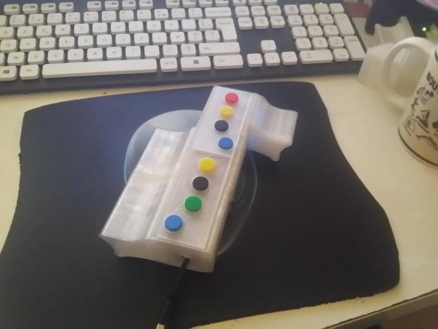

[↩ Sommaire](#sommaire)

# 3 - (1 Février 2019)

## Lancement des tutoriaux sur hackter.io et wikifab   
https://www.hackster.io/labsud   
https://wikifab.org/wiki/Group:LABSud   

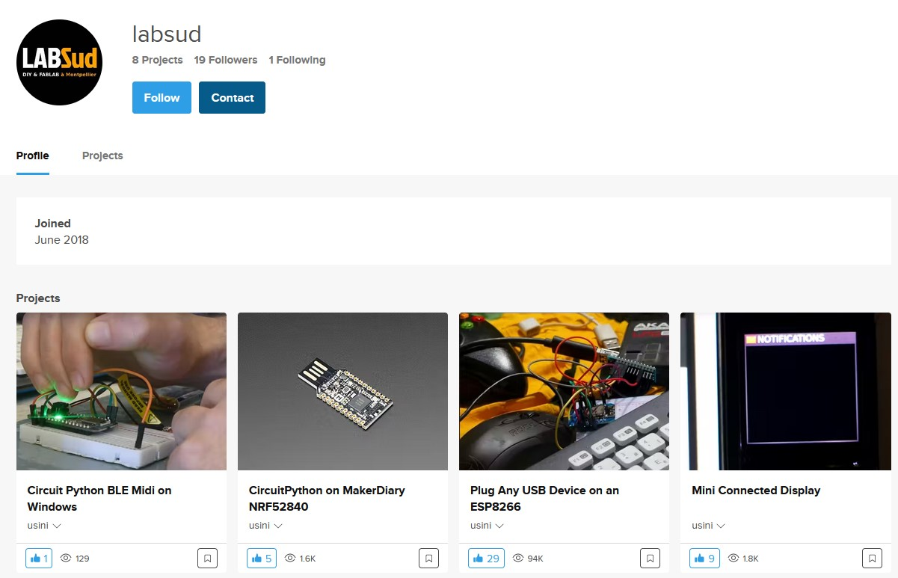
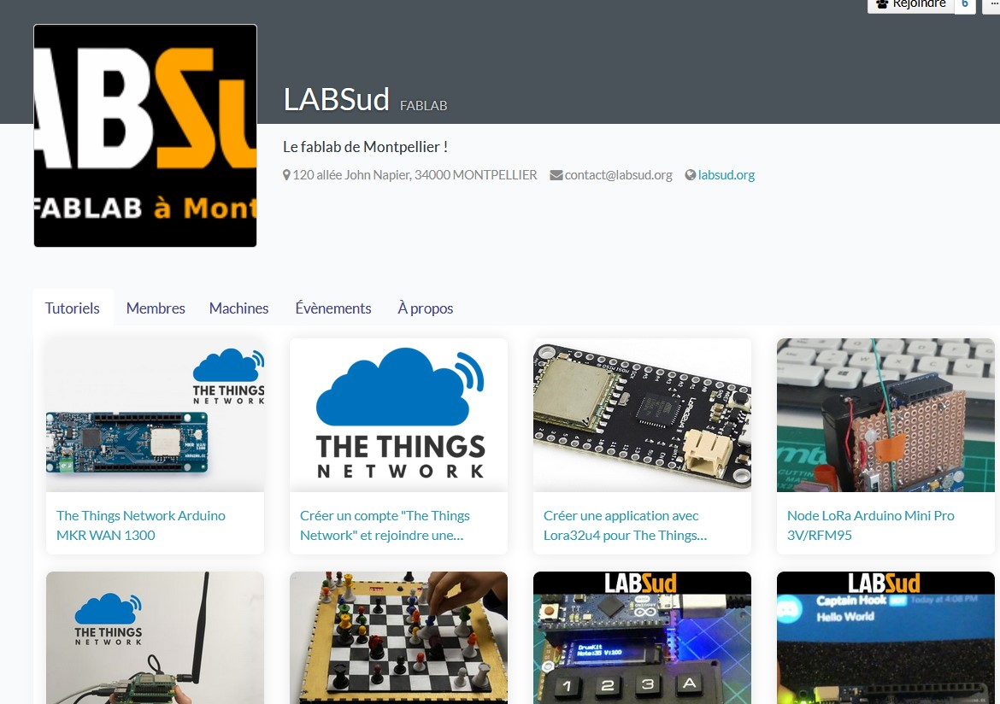

## Contrôler des strips de LED neopixels avec un protocole utilisé par les techniciens lumières (DMX over net ArtNet)   
https://www.hackster.io/labsud
https://wikifab.org/wiki/Contr%C3%B4ler_des_neopixels_comme_un_DJ

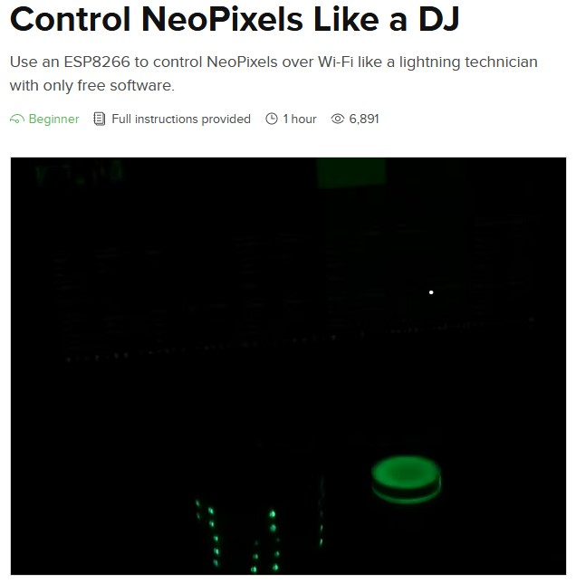

## Présentations des types de moteurs et de comment les contrôler.

[↩ Sommaire](#sommaire)

# 4 - (8 Mars 2019)
## Afficheurs OLED
On vous expliquera comment faire des images voir même des animations ainsi qu’à activer l'UTF8 (parceque les accents c’est bien!)
https://fr.usini.eu/du-pixel-art-sur-vos-ecrans-oled/
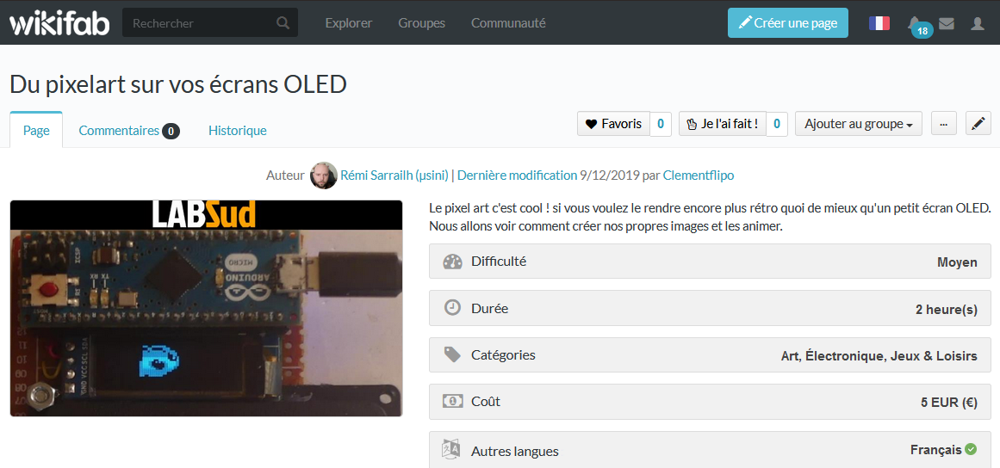

## Arduino MKR1010

Le MKR1010 est une nouvelle carte de chez Arduino, cette carte peut être programmé sans fils depuis la version web d’Arduino et est compatible avec la nouvelle plateforme Arduino IOT cloud.   
https://fr.usini.eu/envoyer-un-message-sur-discord/

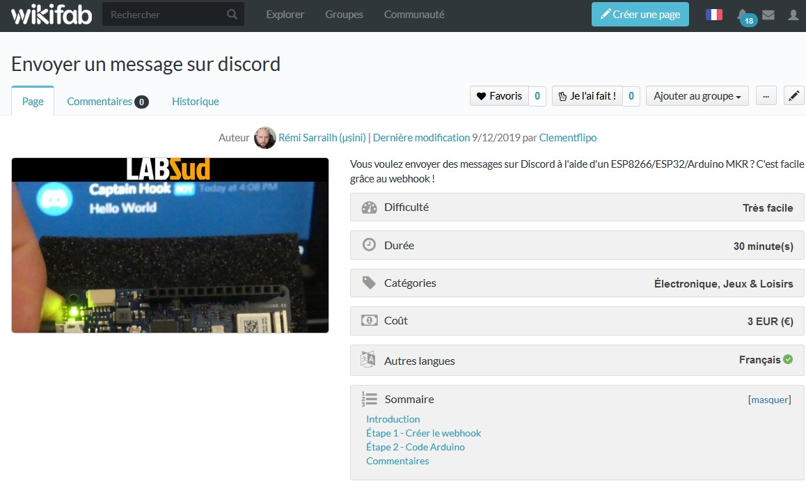

## M5Stick

M5Stack a le vent en poupe avec ces cartes ESP32 très complète à petit prix. (Si vous avez des câbles / composants GROVE amenez en)   
Le M5Stick est leur carte la moins cher, très petite elle embarque un écran OLED, un gyroscope, un buzzer, une batterie et une led IR.
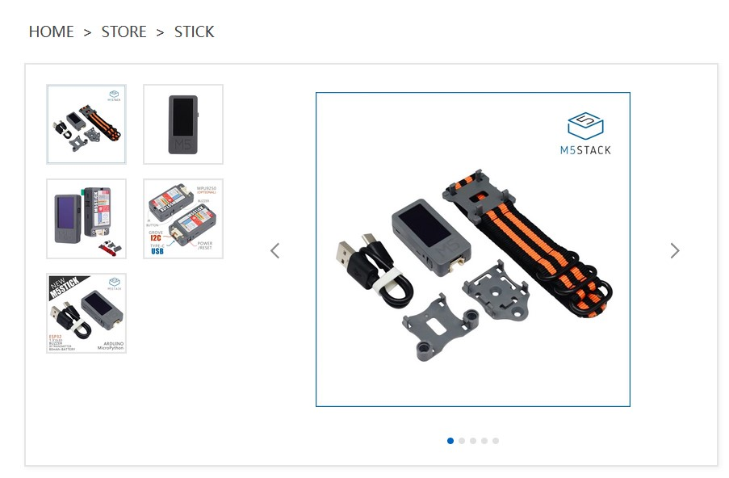

# Arduino Days 2019
Le samedi 16 mars a lieu l'Arduino Days, une célébration internationale de l'anniversaire de l'Arduino et une occasion pour les
passionnés d'électronique de se retrouver.
https://labsud.org/arduino-day-2019-a-labsud/   

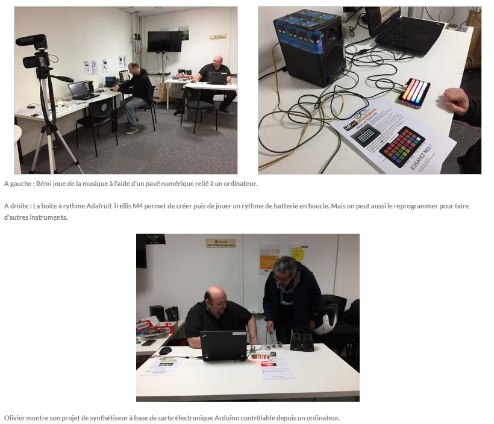

[↩ Sommaire](#sommaire)

## 📄 [Documents Arduino Days 2019](documents/arduinos_days_2019/)

Le LabSud vous propose de découvrir les possibilités du logiciel Arduino sur différentes cartes électroniques à travers les projets des membres, tout l'après-midi.

## Projets Rémi    
* Keypad Midi
https://create.arduino.cc/projecthub/usini/midi-keypad-c68fd2

* Strip de leds connectés (ArtNet/DMX)
https://twitter.com/us1ni/status/1100426436425453568

* Une station météo WiFi ESP32 : https://github.com/usini/epimetheus

* Une console de jeu à base d'ESP32 Odroid Go : 
https://www.hardkernel.com/shop/odroid-go/

* Un Arduino MKR 1010
https://twitter.com/arduino/status/1097586946380046336

* Des arduino avec des écrans OLED
https://twitter.com/arduino/status/1099397643380371463

* Boite à rythme Open Source Adafruit Trellis M4 Express
 https://learn.adafruit.com/adafruit-neotrellis-m4/overview

* M5Stick   
https://docs.m5stack.com/#/en/core/m5stick

[↩ Sommaire](#sommaire)

# 5 - (5 Avril 2019)
Le thème sera les objets connectés et la domotique.

* Présentation de Gladys / Home Assistant
* Quels microcontrôleurs pour créer des objets connectés
* Les logiciels qui permettent de gérer des objets connectés
* Solutions pour connecter des objets à internet
* Transmission par radio
* Gestion des batteries pour des projets basse consommation.

## Microcontrôleurs (domotique)

### Pro Mini (modifié)
Pour du mysensors, le pro mini sans led/régulateur de tensions et un nrf24l01 est intéressant niveau prix.

### Lora32u4
Permet aussi de faire du mysensors (attention pas compatible avec le nrf24l01) mais aussi du The Thing Network
* La consommation est plus elevée.
* Le prix peut sembler élevé mais c'est surtout le transmetteur radio qui gonfle le prix

### Lolin32
D'après Andreas Spiess c'est l'esp32 de le moins cher pour sa consommation électrique en veille     
https://docs.google.com/spreadsheets/d/1Mu-bNwpnkiNUiM7f2dx8-gPnIAFMibsC2hMlWhIHbPQ/edit#gid=0    
* Pas besoin de passerelle radio
* Le WiFi ça consomme plus et ça demande plus de précaution niveau sécurité (là où ça sera juste la passerelle qui a besoin d'être sécurisé pour la radio)
* Si on change le capteur de lieu, il faut reconfigurer chaque capteur, là où avec la radio, seul la passerelle doit être reconfigurer. 

## Logiciels

Pour les logiciels, perso j'ai retenu, si vous en utiliser d'autres faites tourner 😋 
### Solution modulaire
* Mosquitto pour la communication
* Nodered pour la logique
* Grafana / Influx DB pour le stockage / les graphs 

### Domotique
* Domoticz, perso j'aime vraiment pas l'interface et le coté usine à gaz mais faut bien admettre que ça reste un incontournable
* Gladys, dont j'entends beaucoup parler mais que j'ai jamais vraiment tester.
* Home Assistant / ESPHome qui permet de programmer des esp configuré directement depuis l'interface si j'ai bien compris

[↩ Sommaire](#sommaire)

# 6 - (3 Mai 2019)

## Un synthétiseur/sampleur à base d’esp8266 avec entrée USB (USB Host) (mozzi)
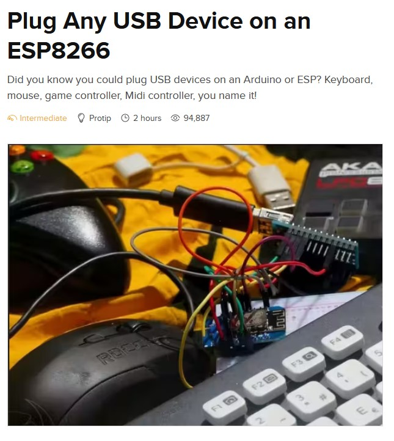

## Une mini matrice de LED connectées (HTTP/MQTT / Chiffrement / Bug overflow)

https://github.com/usini/espmessager

Article d'Odile sur les ateliers DIY Electronique
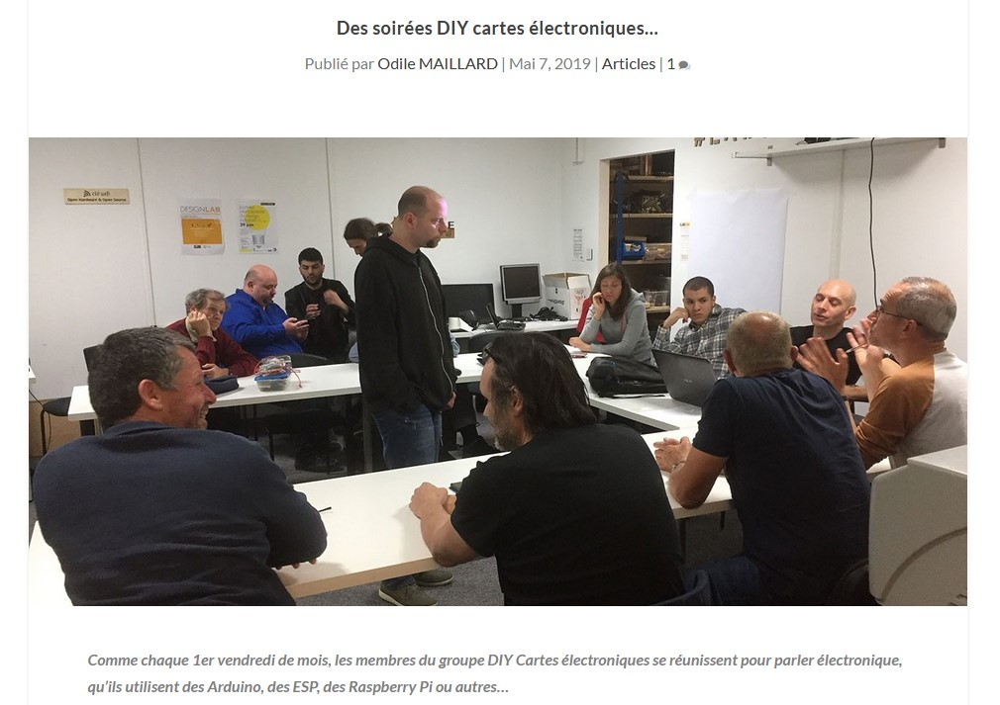   
https://labsud.org/des-soirees-diy-cartes-electroniques/

[↩ Sommaire](#sommaire)

# 7 - (7 Juin 2019)

## Mini matrice de LED contrôlable depuis une interface Web integré ou Node-Red

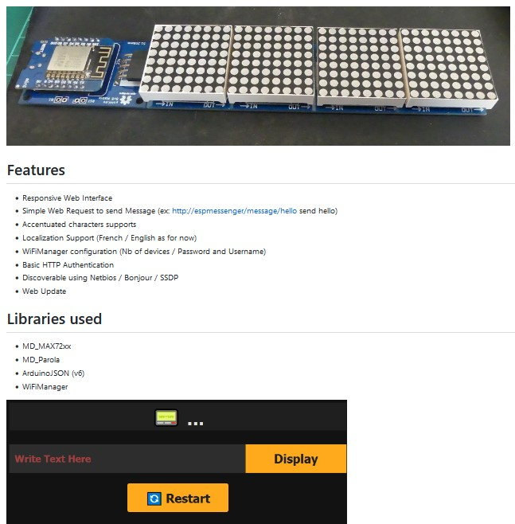
https://github.com/usini/espmessenger

Ce sera l'occasion d'apprendre pleins de choses sur l'esp8266 (et potentiellement l'esp32)

* Comment gérer un serveur web (avec/sans chiffrement) 
* Comment créer une interface web minimaliste
* Comment simuler le serveur web de l'esp8266 grâce à python
* Comment minimisez puis compresser du code HTML en gz dans une variable char[] depuis un script python
* Comment utiliser Ticker pour gérer des fonctions en parallèle du programme (par ex: l'affichage du texte sur la matrix de led) 
* Comment gérer MQTT (avec/sans chiffrement) 
* Comment gérer la configuration depuis un fichier json 
* Comment afficher du texte avec des accents
* etc...

[↩ Sommaire](#sommaire)

# 8 - (5 Juillet 2019)

## Présentation de ma passerelle LoraWan à base d'esp32 
## Capteur BME280 avec un lora32u4 
## intégration sur une interface Mosquitto/NodeRed/Grafana/InfluxDB sur un serveur privé VPS

## Présentation de Julien Doutre sur le projet Ro-boat
http://www.water-robotics.eu/

## Présentation de Patrick du capteur EMG
capteurs-emg

## Croquis / Bibliothèque de la passerelle ESP32 LoRa
A noter
* Ce n'est pas un remplacement à une vrai passerelle avec un SOC (Raspberry Pi)
* Le code est paramétré pour le TTGO-OLED-V1
* Les passerelles n'ont pas besoin de configuration sur TTN (juste le point d'accès WiFi
* J'ai fait des modifications le code sur github n'a pas marché directement (je préciserais pourquoi quand j'aurais un peu de temps)
* Il est possible de décoder directement les capteurs sur l'ESP32
ce qui rend cette passerelle intéressant comme backup en cas de déconnexion de la passerelle d'internet ou comme substitut en attendant d'avoir une passerelle connecté à internet.

Basé sur ces explications : https://learn.sparkfun.com/tutorials/esp32-lora-1-ch-gateway-lorawan-and-the-things-network/all
http://things4u.github.io/

[↩ Sommaire](#sommaire)

# 9 - (6 Septembre 2019)

## Recyclage Netbook en bartop
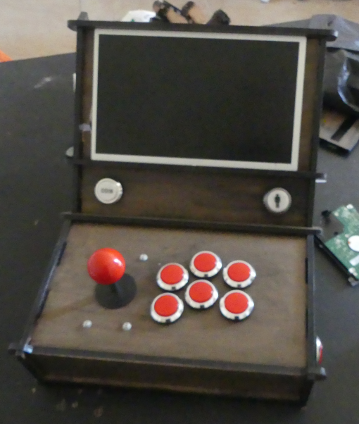

## Présentation des M5Stick-C
https://docs.m5stack.com/#/en/core/m5stickc

Je me suis penché sur les M5Stick-C de M5Stack.
M5Stack est une entreprise chinoise basée à Shenzhen (surprenant non 🙂 ) qui vend des kits ESP32 à des prix très corrects ainsi que des modules pour celui-ci.
https://docs.m5stack.com/#/en/core/m5stickc

Leur produit phare sont les m5Stack mais ils coûtent assez cher, là où les M5stick-C coûtent 9,95$ (frais de port non compris) pour ce prix-là on a :

* un ESP32 dans un boitier
* 5 broches disponibles (3 en broches et 2 avec un câble groove)
* Un gyroscope / accéléromètre (MPU6886)
* 2 Boutons
* Un système de gestion de l'alimentation (AXP192) capable de fournir du 5V et de mettre en veille l'ESP32
* Une entrée USB-C
* Une LED infrarouge (la portée n'est pas terrible)
* Une LED
* Un micro numérique (SPM1423)
* Un écran TFT 80x160 (ST7735R)
* Une batterie de 80mAh
* Un câble USB-C

La livraison standard prend son temps (2 à 3 semaines), je l'avais testé avec l'ancienne version du M5Stick.
La livraison DHL a pris quand même une bonne semaine, la raison étant que la douane est passée par là (je la déconseille du coup).

### Programation

Afin de programmer le M5Stick-C, M5Stack propose 3 choix :

* UI-Flow, un système de bloc Scratch (programmable à distance) mais il est très limité pour le M5Stick-C, le système est basé sur Micropython et permet de choisir directement depuis l'écran, plusieurs programmes.

* Micropython (utilisable avec UI-flow en même temps) mais leur version ne contient pas certaines fonctionnalités de la version officielle (WebREPL par ex.), toutefois il est possible d'installer la version officielle (mais on a plus les modules pour faciliter l'usage de l'écran)

* Arduino : Les bibliothèques sont disponibles directement dans le logiciel Arduino, c'est quasiment le seul moyen de pouvoir accéder à toutes les fonctionnalités facilement.

### Led Infrarouge
La Led IR est assez marrante, mais la portée me semble très faible, avec IRremoteESP8266, on a accès à un paquet de protocole
https://github.com/crankyoldgit/IRremoteESP8266

### Communication MQTT
Je l'ai testé comme télécommande pour allumer la salle de formation, ça marche bien, l'écran permet d'avoir un retour sur ce qui se passe.

### Mode Veille / Capteur PIR
A l'aide d'un capteur PIR de KeyStudio, j'ai fait un capteur connecté sur un serveur VPS en MQTT chiffré avec la mise en veille de l'ESP32.
J'ai réussi avec 1 à 2 activations par heure à tenir 12h.

### Strip Neopixels
'ai testé le contrôle de neopixels avec Micropython, et c'est assez simple à utiliser par ce biais, l'avantage est que l'on a un retour direct sur les commandes et l'on peut créer des fonctions afin de simplifier la programmation.

[↩ Sommaire](#sommaire)

# 10 - (4 Octobre 2019)
## Portes ouvertes
https://twitter.com/us1ni/status/1180427585148325890

### Console ESP32 - 
#odroid-go 
### Adafruit Trellis m4 - 
#adafruit-trellis-m4 
### Synthé midi à base de keypad 
#keypad-midi 
### Capteur météo LoRaWan: #8ème-atelier 
### Afficheur epaper météo sur batterie 
#epaper-météo 
### Clavier Twitter 
#m5stick-twitter 
### Capteur PIR MQTT 
#m5stick-pir 
### Station météo Yun : https://m5stack.com/collections/m5-unit/products/m5stickc-yun-hatsh20-bmp280-sk6812
### M5Stick-C Neoflash :  https://docs.m5stack.com/#/en/hat/hat-neoflash
### Lightbar 
#lightbar 
### ESPMessenger 
### minimatrix-leds 
* Raspberry  Pi / Matrix de LED : https://github.com/darknessii/rpi-matrix-artnet /  https://t.co/pBT0WUjhOn 

[↩ Sommaire](#sommaire)

# 11 - (Novembre 2019)

## LoraCube
## Minimatrix-leds
## Lightbar
## Pwnagotchi

## Youtubers / Tutos ESP32

* Brian Lough (Matrice de LED): https://www.youtube.com/user/witnessmenow
* Unexpected Maker (Conception carte ESP open source ): https://unexpectedmaker.com/
* Andreas Spiess : (Tutoriels ESP) https://www.youtube.com/channel/UCu7_D0o48KbfhpEohoP7YSQ
* RandomNerdTutorials : (Tutoriels ESP32) https://randomnerdtutorials.com/

* https://github.com/gmag11/painlessMesh

[↩ Sommaire](#sommaire)

# 12 - (Décembre 2019)

[↩ Sommaire](#sommaire)

# 13 - (Janvier 2020)
## [Projets Musicals et LoraWan (pdf)](documents/Projets_Musiques_et_LoraWan.pdf)    

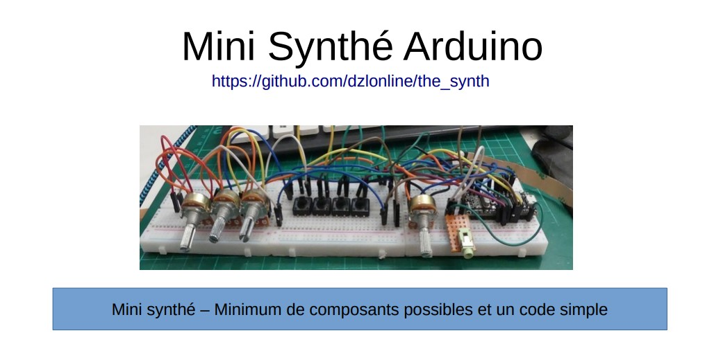   
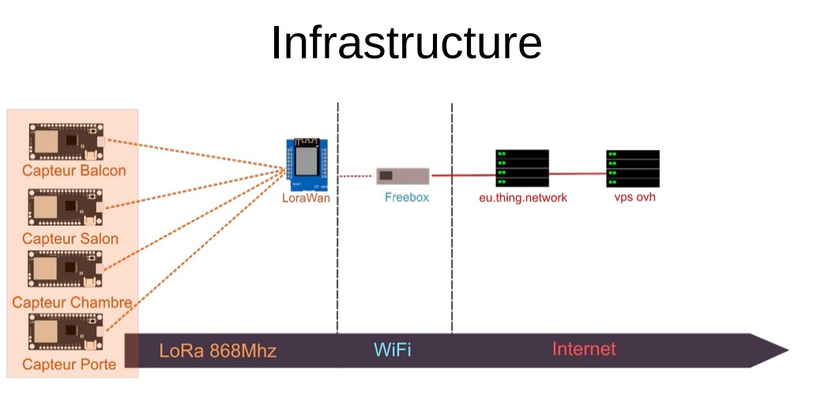   

Tutoriels LoRa     
https://www.youtube.com/channel/UCG5_CT_KjexxjbgNE4lVGkg   

[↩ Sommaire](#sommaire)

# 14 - (Février 2020)

Pour ce mois-ci, j'ai pas mal de petits projets sous la main:   
Dans l'objectif de créer des kits open hardware facile à souder et pas cher, j'ai travaillé sur ces 3 projets.    

## Lum0s : Un strip de LED RGBW WiFi alimenté par un Powerbank
https://github.com/usini/lum0s   
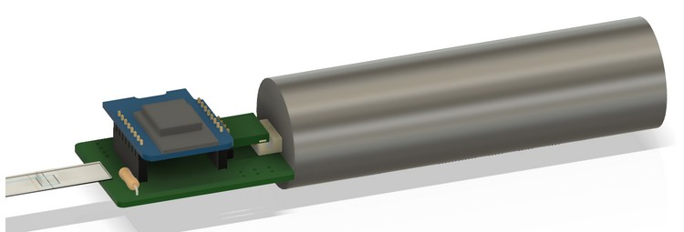

### s1nT : Un synthé à base d'Arduino Nano :
https://github.com/usini/s1nt    

### espMessenger : Une matrice de LED WiFi pour afficher des messages
https://github.com/usini/espMessenger     

J'ai aussi reçu deux cartes de prototypage :

## MakerDiary NRF52840 USB Dongle
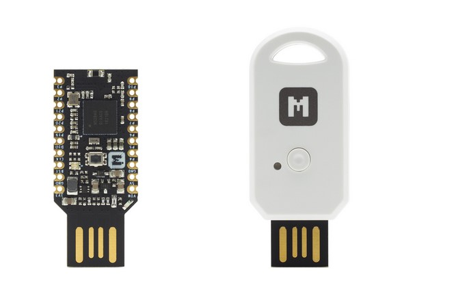    
https://wiki.makerdiary.com/nrf52840-mdk-usb-dongle/    
Une carte à base de ARM Cortex-M4F Bluetooth Low Energy compatible Circuit Python, sa consommation électrique est de plus ridiculement faible (3.16µA en fonctionnement et 16.40ma avec le Bluetooth en pleine puissance)    

## M5Stack Atom Matrix 
Et oui j'ai craqué pour la nouvelle carte de M5Stack : https://docs.m5stack.com/#/en/core/atom_matrix    

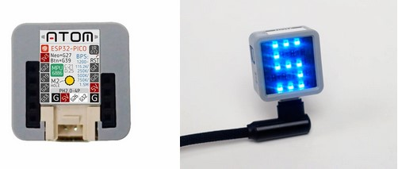

Si vous voulez suivre un peu plus au jour le jour, mes projets, n'hésitez pas à me suivre sur twitter : https://twitter.com/m4dnerd    

### Mur de leds (WS2811) avec caméra ESP32
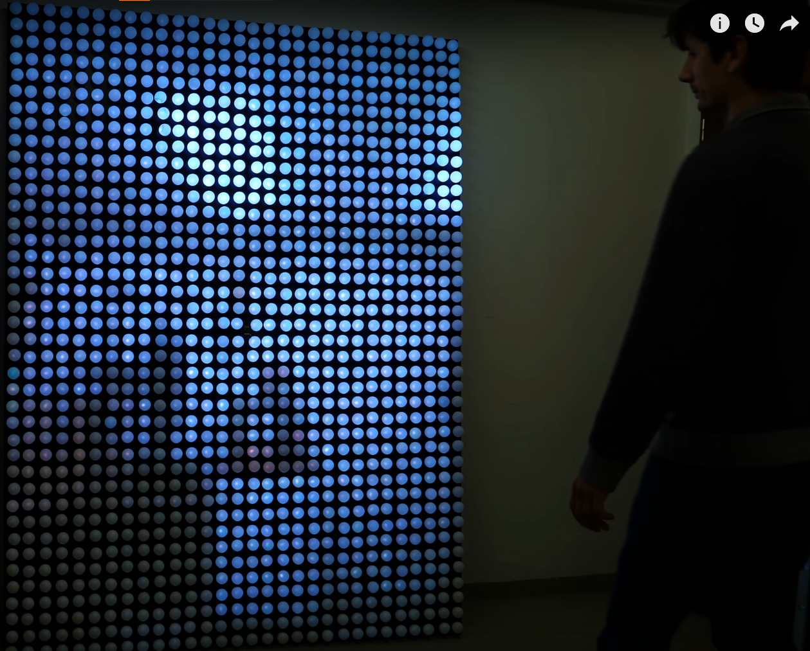
https://www.youtube.com/watch?v=ikhZ34WgObc

[↩ Sommaire](#sommaire)

# 15 - (5 Mars 2020)

## Conception PCB
Pour cette session, je propose de parler de Kicad et de conception de PCB.  
On pourrait voir comment fabriquer ce thermomètre connecté : https://github.com/mcer12/Temper-ESP8266   
Les plans du PCB et l'assemblage (en grande partie) depuis JLCPCB sont disponibles.    

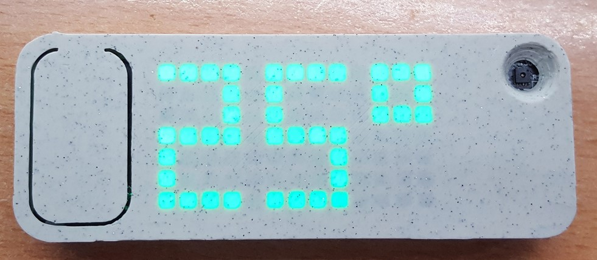   

## Musique (AY-3-8910)

J'apporterais aussi cette puce : AY-3-8910A, c'est la puce qui gère le son du ZX-Spectrum (entre autre) et apparemment il est possible de la contrôler avec un arduino micro,   
mais je n'ai pas réussi à la faire marcher : https://hackaday.com/2019/07/30/chiptunes-via-usb-midi-with-the-ay-3-8910/   

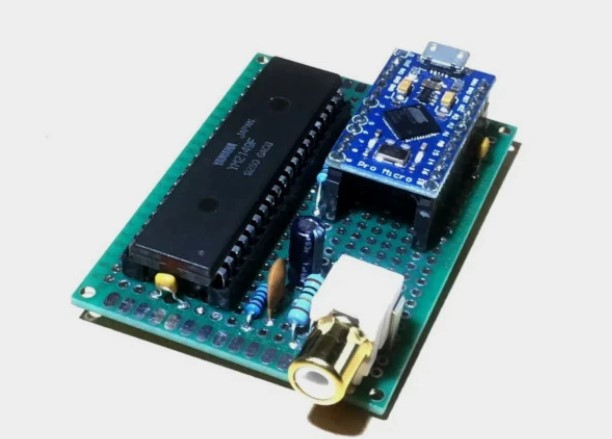   

[↩ Sommaire](#sommaire)
